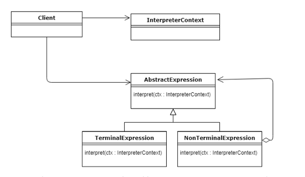

# Interpreter (Behavioural Pattern)

## Overview

## Intent

## UML Diagram

## Code Example

## Example Output

## Mapping the UML classes to Example code
| **File/Class Name** | **Mapping Class in UML**  |
| :-----: | :-: |

## Points to Remember

## Resources
- https://www.baeldung.com/java-interpreter-pattern