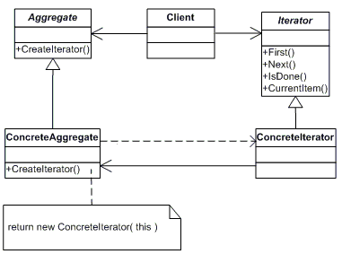
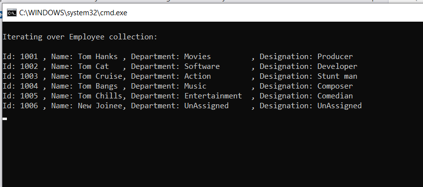

# Iterator (Behavioural Pattern)

## Overview
This pattern provides a way to abstract the traversal of different data structures so that the client can access them without having to worry about the type of data stored. For example algorithms can be defined which work on different data types stored in a iteratable data structure. 

## Intent
Provide a way to access the elements of an aggregate object sequentially without exposing its underlying representation.

## UML Diagram

## Code Example
Code shows how the list of employees can be iterated without affecting the data type (Employee).

## Example Output

## Mapping the UML classes to Example code
| **File/Class Name** | **Mapping Class in UML**  |
| :-----: | :-: |
|[Base.Enumerable/IEnumerableData.cs/Iterator Interface](./Base.Enumarable/IEnumarableData.cs)|*Iterator*|
|[Base.Enumerable/IEnumerableData.cs/Aggregator Interface](./Base.Enumarable/IEnumarableData.cs)|*Aggregate*|
|[Base.Enumerable/EmployeeList.cs/EmployeeList class](./Base.Enumarable/EmployeeList.cs)|*Concrete Aggregate*|
|[Base.Enumerable/EmployeeList.cs/EmployeeIterator class](./Base.Enumarable/EmployeeList.cs)|*Concrete Iterator*|
|[App.Main.Iterator/Program.cs/MainApp class](./App.Main.Iterator/Program.cs)|*Client*|

## Points to Remember

## Resources
- http://www.blackwasp.co.uk/Iterator.aspx
- https://www.dofactory.com/net/iterator-design-pattern
