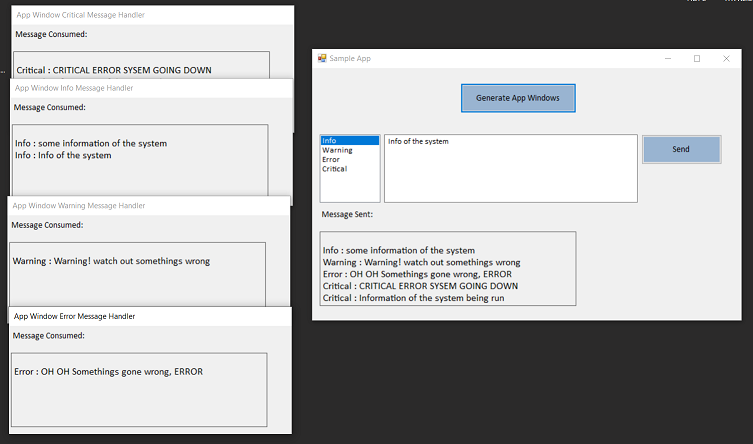

# Mediator (Behavioural Pattern)

## Overview
The pattern promotes one to define an object(Mediator) that encapsulates how a set of objects interact. Mediator promotes loose coupling by keeping objects from referring to each other explicitly, and it lets you vary their interaction independently.

## Intent
Mediator is a behavioral design pattern that lets you reduce chaotic dependencies between objects. The pattern restricts direct communications between the objects and forces them to collaborate only via a mediator object.

## UML Diagram

## Code Example
In the example a single MsgMediator class mediates between the handlers of different message types in the system. The main app as sample generates different types of message. The MSGMediator routes the message to the registered consumer of the type of message. Please note for simplicity the message is generated in one place, the messages could be generated in different parts of the system, in the absence of a mediator this would result in all the applications talking to one another to send / receive messages.

Note that if the Mediator class only routed the events to its consumers then this just looks like an class encapsulating the Observer pattern. With the additional resposibility of routing the message to the right subscriber, and handling of the critical message by raising alarm etc, this becomes a mediator.

## Example Output

## Mapping the UML classes to Example code
| **File/Class Name** | **Mapping Class in UML**  |
| :-----: | :-: |
|[Library.MessageRouter/IMessageConsumer.cs](./Library.MessageRouter/IMessageConsumer.cs)|*Coleague Interface*|
|[Library.MessageRouter/IMessageMediator.cs](./Library.MessageRouter/IMessageMediator.cs)|*Mediator Interface*|
|[Library.MessageRouter/MsgMediator.cs](./Library.MessageRouter/MsgMediator.cs)|*Concrete Mediator*|
|[AppWindow Instance 1](./App.Main/AppWindow.cs)|*Concrete Coleague1*|
|[AppWindow Instance 2](./App.Main/AppWindow.cs)|*Concrete Coleague2*|
|[AppWindow Instance 3](./App.Main/AppWindow.cs)|*Concrete Coleague3*|
|[AppWindow Instance 4](./App.Main/AppWindow.cs)|*Concrete Coleague4*|

## Points to Remember
[This article](https://sourcemaking.com/design_patterns/mediator) has a good picture to depict the pattern in a very simple manner

- Mediator and Observer are competing patterns. The difference between them is that Observer distributes communication by introducing "observer" and "subject" objects, whereas a Mediator object encapsulates the communication between other objects. We've found it easier to make reusable Observers and Subjects than to make reusable Mediators.

- On the other hand, Mediator can leverage Observer for dynamically registering colleagues and communicating with them. (As done in the example here). [Refer here for more info](https://softwareengineering.stackexchange.com/questions/134432/mediator-vs-observer)

- Mediator is similar to Facade in that it abstracts functionality of existing classes. Mediator abstracts/centralizes arbitrary communication between colleague objects, it routinely "adds value", and it is known/referenced by the colleague objects (i.e. it defines a multidirectional protocol). In contrast, Facade defines a simpler interface to a subsystem, it doesn't add new functionality, and it is not known by the subsystem classes (i.e. it defines a unidirectional protocol where it makes requests of the subsystem classes but not vice versa).
A Facade is a structural pattern which all encopasses multiple functionality into one. It does not add its own logic in doing so. It does not change the 'behaviour' of the system in doing so. Where as a Mediator class encompasses multiple objects that wishes to communicate with one another by adding additional logic required to handle the objects behaviours. [Refer here](https://stackoverflow.com/questions/481984/fa%c3%a7ade-vs-mediator)

## Resources
- https://www.dofactory.com/net/mediator-design-pattern
- https://refactoring.guru/design-patterns/mediator
- https://sourcemaking.com/design_patterns/mediator
- https://softwareengineering.stackexchange.com/questions/134432/mediator-vs-observer
- 
