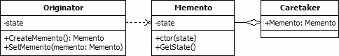

# Memento (Behavioural Pattern)

## Overview
The memento pattern is a design pattern that permits the current state of an object to be stored without breaking the rules of encapsulation. The originating object can be modified as required but can be restored to the saved state at any time.
The Memento Design Pattern offers a solution to implement undoable actions. We can do this by saving the state of an object at a given instant and restoring it if the actions performed since need to be undone.

## Intent
- Without violating encapsulation, capture and externalize an object's internal state so that the object can be returned to this state later.
- A magic cookie that encapsulates a "check point" capability.
- Promote undo or rollback to full object status.

## UML Diagram

The items in the diagram are described below:
- Originator. This is the class whose state is to be stored. The Originator includes a method, named "CreateMemento", that is used to generate a Memento object containing a snapshot of the Originator's current state. It also includes the "SetMemento" method, which restores the Originator to a previously stored state.
- Memento. The Memento class is used to hold the information from an Originator's state. The amount of information held is controlled by the Originator. The Memento can provide protection against change to the stored state by including a very limited interface with no means of modifying the values it holds.
- Caretaker. The Caretaker class is used to hold a Memento object for later use. The Caretaker provides storage only; it should neither examine nor modify the contents of the Memento object. In the UML diagram and the examples in this article the Caretaker holds a single Memento object. It can be modified to hold a collection of Mementos to support multi-level undo and redo functionality.

## Code Example

## Example Output

## Mapping the UML classes to Example code
| **File/Class Name** | **Mapping Class in UML**  |
| :-----: | :-: |
|[Base.Interface/abc.cs](./Base.Interface/abc.cs)|*client*|

## Points to Remember
- If the state of the Originator is heavy, using the Memento Design Pattern can lead to an expensive creation process and increased use of memory.
- Command and Memento act as magic tokens to be passed around and invoked at a later time. In Command, the token represents a request; in Memento, it represents the internal state of an object at a particular time. Polymorphism is important to Command, but not to Memento because its interface is so narrow that a memento can only be passed as a value.
- Command can use Memento to maintain the state required for an undo operation.
- Memento is often used in conjunction with Iterator. An Iterator can use a Memento to capture the state of an iteration. The Iterator stores the Memento internally.
- There are variations of this pattern on the web which make caretaker calk to the Originator. The example here is as explained in GOF.

## Resources
- http://www.blackwasp.co.uk/memento.aspx
