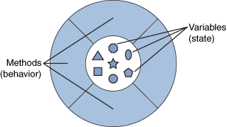

# Behavioural Pattern

## Overview
An objects in by OOP definition has two main characteristics. 
The object's state and its behaviour. 

The Behavioural Design Patterns identify the common communication mechanisms between objects, behaviour of the objects on different conditions and realize these in a standard way.

Different Behavioural Design Patterns are
- [Chain of responsibility](./ChainOfResponsibility)
- Command
- Interpreter
- [Iterator](./Iterator)
- [Mediator](./Mediator)
- [Memento](./Memento)
- [Null Object](./NullObject)
- [Observer](./Observer)
- [State](./State)
- [Strategy](./Strategy)
- [Template method](./TemplateMethod)
- Visitor

## Resources
 - https://sourcemaking.com/design_patterns/behavioral_patterns
