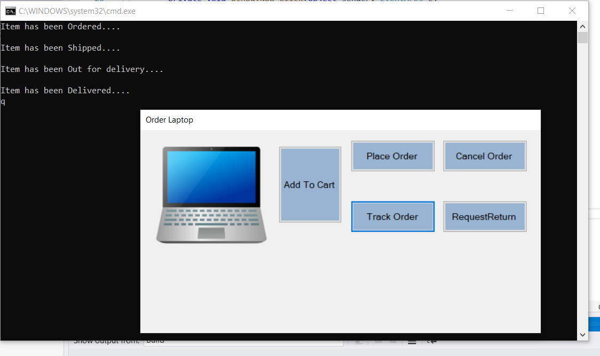

# State (Behavioural Pattern)

## Overview
State is a behavioral design pattern that lets an object alter its behavior when its internal state changes. It appears as if the object changed its class.

## Intent
The main idea is that, at any given moment, there’s a finite number of states which a program can be in. Within any unique state, the program behaves differently, and the program can be switched from one state to another instantaneously. However, depending on a current state, the program may or may not switch to certain other states. These switching rules, called transitions, are also finite and predetermined.

## UML Diagram

## Code Example
The example takes an order and shows the order moving different states like InCart, Ordered, Shipped, OutForDelivery, Delivered, Cancelled etc.

## Example Output

## Mapping the UML classes to Example code
| **File/Class Name** | **Mapping Class in UML**  |
| :-----: | :-: |
|[Base.Enumerable/IEnumerableData.cs/Iterator Interface](./Base.Enumarable/IEnumarableData.cs)|*Iterator*|

## Points to Remember

## Resources
- https://www.dofactory.com/net/state-design-pattern
