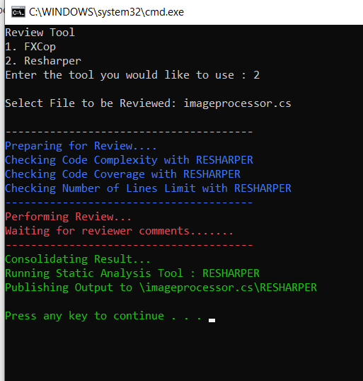

# (Behavioural Pattern)

## Overview

Template Method is a behavioral design pattern that defines the skeleton of an algorithm in the superclass but lets subclasses override specific steps of the algorithm without changing its structure.

## Intent
- Define the skeleton of an algorithm in an operation, deferring some steps to client subclasses. Template Method lets subclasses redefine certain steps of an algorithm without changing the algorithm's structure.
- Base class declares algorithm 'placeholders', and derived classes implement the placeholders.

## UML Diagram

## Code Example

## Example Output

## Mapping the UML classes to Example code
| **File/Class Name** | **Mapping Class in UML**  |
| :-----: | :-: |
|[Base.Enumerable/IEnumerableData.cs/Iterator Interface](./Base.Enumarable/IEnumarableData.cs)|*Iterator*|

## Points to Remember
- Use the Template Method pattern when you want to let clients extend only particular steps of an algorithm, but not the whole algorithm or its structure.
- The Template Method lets you turn a monolithic algorithm into a series of individual steps which can be easily extended by subclasses while keeping intact the structure defined in a superclass.
- Use the pattern when you have several classes that contain almost identical algorithms with some minor differences. As a result, you might need to modify all classes when the algorithm changes. 
- When you turn such an algorithm into a template method, you can also pull up the steps with similar implementations into a superclass, eliminating code duplication. Code that varies between subclasses can remain in subclasses.
- Strategy is like Template Method except in its granularity.
- Template Method uses inheritance to vary part of an algorithm. Strategy uses delegation to vary the entire algorithm.
- Strategy modifies the logic of individual objects. Template Method modifies the logic of an entire class.
- Factory Method is a specialization of Template Method.

## Resources
- https://sourcemaking.com/design_patterns/template_method
- https://refactoring.guru/design-patterns/template-method
