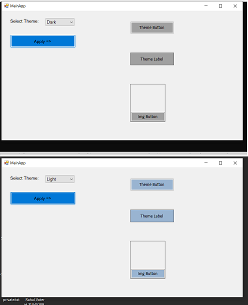

# Abstract Factory (Creational Pattern)

## Overview
Abstract factory is a creational pattern which allows you to create not one product like Factory method, but family of products without exposing the details of the concrete classes to the client.
Abstract Factory offers the interface for creating a family of related objects, without explicitly specifying their classes.

## Intent
- Remove new operator from the client code
- Create family of related or dependent products without revealing the details of concrete classes.

## UML Diagram

## Example Code
In the example we have set of GUI controls that provide the default control behaviour. Then there are different variations of these controls like - light theme controls and dark theme controls. If everytime a client needs to create a control if it needs to evalutate the "current" theme and create the necessary control, that would be a nightmare of a code to manage. Enter Abstract factory pattern. Using this pattern we have factories for creating different themes, different variations of the base set of controls. The client code is only responsible of switching between these factories.

## Mapping the UML classes to Example code
| **File/Class Name** | **Mapping UML Class Name**  |
| :-----: | :-: |
| [Base.Interfaces/IGUIFactory.cs](./Base.Interfaces/IGUIFactory.cs)| *Common Interface for Concrete factories* |
| [Factory.GUIControls/GuiControlFactory.cs](./Factory.GUIControls/GuiControlFactory.cs)| *AbstractFactory*|
| [Factory.GUIControls/LightThemeFactory.cs](./Factory.GUIControls/LightThemeFactory.cs)| *ConcreteFactoryA*|
| [Factory.GUIControls/DarkThemeFactory.cs](./Factory.GUIControls/DarkThemeFactory.cs)| *ConcreteFactoryB*|
| [Base.GUIControls/ActionButton.cs](./Base.GUIControls/ActionButton.cs)|*ProductA*|
| [Base.GUIControls/ImageButton.cs](./Base.GUIControls/ImageButton.cs)|*ProductB*|
| [Base.GUIControls/CenteredLabel.cs](./Base.GUIControls/CenteredLabel.cs)|*ProductC*|
| [GUIControls.LightTheme/LightActionButton.cs](./GUIControls.LightTheme/LightActionButton.cs)|*ConcreteProductA1*|
| [GUIControls.LightTheme/LightImageButton.cs](./GUIControls.LightTheme/LightImageButton.cs)|*ConcreteProductB1*|
| [GUIControls.LightTheme/LightCenteredLabel.cs](./GUIControls.LightTheme/LightCenteredLabel.cs)|*ConcreteProductC1*|
| [GUIControls.DarkTheme/DarkActionButton.cs](./GUIControls.DarkTheme/DarkActionButton.cs)|*ConcreteProductA2*|
| [GUIControls.DarkTheme/DarkImageButton.cs](./GUIControls.DarkTheme/DarkImageButton.cs)|*ConcreteProductB2*|
| [GUIControls.DarkTheme/DarkCenteredLabel.cs](./GUIControls.DarkTheme/DarkCenteredLabel.cs)|*ConcreteProductC2*|
| [App.Main.AbstractFactory/Program.cs](./App.Main.AbstractFactory/Program.cs) | *Sample UI to show the working of two themes* |

## Applicability & Examples
We should use the Abstract Factory design pattern when:
the system needs to be independent from the way the products it works with are created.
the system is or should be configured to work with multiple families of products.
a family of products is designed to work only all together.
the creation of a library of products is needed, for which is relevant only the interface, not the implementation, too.

## Points to Remember
- Abstract Factory is usually realized using Factory method
- For configuring the abstract factory, it is possible to use prototype too
- Abstract factory is usually not used for a single product. It is used for families of products.

## Resources
- https://sourcemaking.com/design_patterns/abstract_factory
- https://refactoring.guru/design-patterns/abstract-factory
- https://www.javatpoint.com/abstract-factory-pattern

