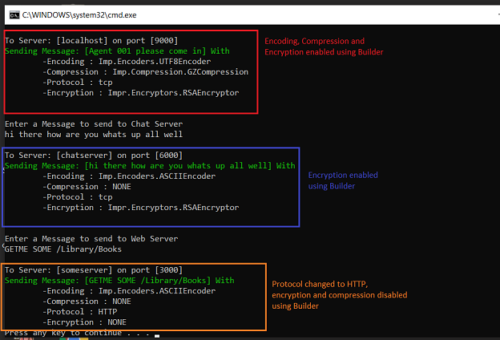

# Builder Pattern (Creational Pattern)

## Overview
In classes that have a lot of fields you oftentimes end up with many constructors as you might need objects using different field combinations. This pattern enables a more readable object creation and let’s you specify the fields that are actually needed. 

The Builder pattern is a Creational Design Pattern which helps in constructing a complex object from simple objects using step-by-step approach.

The pattern allows you to create different flavors of an object while avoiding constructor pollution. This pattern is useful when there could be several flavors of an object. Or when there are a lot of steps involved in creation of an object.
## Intent
- Remove constructor with lot of parameters from the client code
- Separate the construction of a complex object from its representation
- Same construction code (Builder) creates different representations of a particular kind of object

## UML Diagram

## Code Example
The Example shows a communication framework which is built using Builder Pattern.
In the Example the client calls the Director class methods to create the communication channel.
Once created, the client can only worry about the messages to be sent and received.

The Director class makes the decision of what kind/representation of the Product (Channel) that is required.
The Director uses the Builder to build the parts of the communication channel step by step.

The communication framework is not implementation complete. The idea is to show the Builder pattern and how it can be used to get different flavours rathen than having a completely working communcation framework.

## Mapping the UML classes to Example code
| **File/Class Name** | **Mapping UML to Example Code**  |
| :-----: | :-: |
| [Imp.Builder/Builder.cs](./Imp.Builder/Builder.cs)| *Builder class which creates different representations of Product* |
| [Imp.Director/ChattyDirector.cs](./Imp.Director/ChattyDirector.cs)| *Director that using Builder creates a chatty communication channel* |
| [Imp.Director/WebDirector.cs](./Imp.Director/WebDirector.cs)| *Director that using Builder creates a communication channel for web communication* |
| [Imp.Director/SecureDirector.cs](./Imp.Director/SecureDirector.cs)| *Director that using Builder creates a secure communication channel* |
| [Base.CommunicationFramework/Channel.cs](./Base.CommunicationFramework/Channel.cs)| *The Product Interface* |
| [Base.CommunicationFramework/ServerChannel.cs](./Base.CommunicationFramework/ServerChannel.cs)| *The Concrete Product1* |
| [Base.CommunicationFramework/ClientChannel.cs](./Base.CommunicationFramework/ClientChannel.cs)| *The Concrete Product2* |

## Points to Remember
- The key difference from the factory pattern is that; factory pattern is to be used when the creation is a one step process while builder pattern is to be used when the creation is a multi step process.
- A complex builder could internally use other creational patterns like Factory Method, Prototype or abstract factory.
- Usually the system designs start with a Factory method. As the system evolves the design evolves into either Abstract Factory or Builder or sometimes Builder which internally uses Abstract Factory for construction of its objecs and their representation.
- Be aware: Builders can be [anti-pattern](https://quinngil.com/2019/12/17/builders-as-an-antipattern/) if used unnecessarily. 

## Resources
- https://sourcemaking.com/design_patterns/builder
- https://refactoring.guru/design-patterns/builder
- https://blog.tratif.com/2017/11/17/builder-pattern-revisited/
- https://quinngil.com/2019/12/17/builders-as-an-antipattern/
