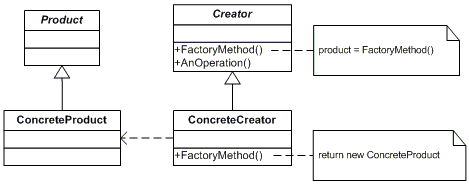
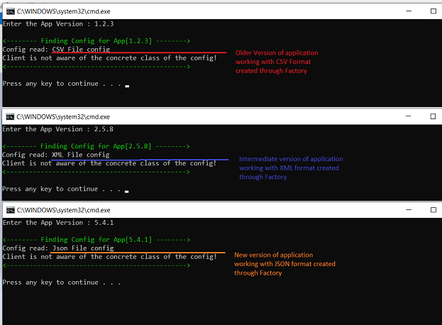

# Factory Method (Creational Pattern)
## Overview
Factory method or Factory Design Pattern is a creational design pattern that provides an interface for creating objects but allows subclasses to alter the type of an object that will be created.

In this pattern, we create object without exposing the creation logic to client and the client use the same common interface to create new type of objects. 

## Factory method UML Diagram

## Intent
- "new" operator thorughout the client code is harmful
- Separate the creational logic of the **Product** from the **Client** and move to **Creator**
- Defer the instantiation logic to sub classes to enable extensibility

## Code Example
The Example depicts a system which was built with its configuration in CSV format. Over time as the technology evolved and the complexity of the system increased, the system was moved to XML based configuration. Later on with support of web based application, the configuration in the JSON format is supported.

In this example, Different Repositories (Creator) can choose which  Configuration (Product) to create.
Supporting a new configuration only needs new implementation and plugging in the code to the creation loigc.

## Mapping the UML classes to Example code
| **File/Class Name** | **Mapping UML Class Name**  |
| :-----: | :-: |
| [BaseInterfaces/IConfig.cs](./BaseInterfaces/IConfig.cs)| *Product* |
| [CSVConfig/CSVConfig.cs](./CSVConfig/CSVConfig.cs)| *ConcreteProduct1*|
| [XMLCOnfig/XMLConfig.cs](./XMLConfig/XMLConfig.cs)| *ConcreteProduct2*|
| [JSONConfig/JsonConfig.cs](./JSonConfig/JsonConfig.cs)| *ConcreteProduct3*|
| [RepoFactory/ConfigRepoFactory.cs](./RepoFactory/ConfigRepoFactory.cs) | *Creator* |
| [RepoFactory/CSVRepoFactory.cs](./RepoFactory/CSVRepoFactory.cs)| *ConcreteCreator1*|
| [RepoFactory/XMLRepoFactory.cs](./RepoFactory/XMLRepoFactory.cs)| *ConcreteCreator2*|
| [RepoFactory/JsonRepoFactory.cs](./RepoFactory/JsonRepoFactory.cs)| *ConcreteCreator3*|
| [AppMain/Program.cs](./AppMain/Program.cs) | *main() function, invoker of client* |

## Points to Remember
- Factory Method is creation through inheritance.
- Consider designing an internal "object pool" that will allow objects to be reused instead of creating from scratch (as in this example).
- It is a common practice to start with a simple factory method by removing the inheritance in the Creator class and have the inheritance only in product. However as system evolves if need arises, the simple factory method turns into pattern as described in picture above as a natural progression.  

## Useful Resources
- [https://sourcemaking.com/design_patterns/factory_method](https://sourcemaking.com/design_patterns/factory_method)
- [https://www.dofactory.com/net/factory-method-design-pattern](https://www.dofactory.com/net/factory-method-design-pattern)
- [https://refactoring.guru/design-patterns/factory-method](https://refactoring.guru/design-patterns/factory-method)
