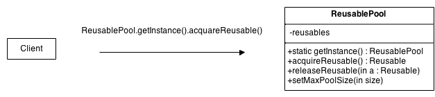

# Object Pool(Creational Pattern)

## Overview
When objects are expensive to create and/or they are needed only for short periods of time it is advantageous to utilize the Object Pool pattern. 

The Object Pool provides a cache for instantiated objects reuse. Cache performs tracking of which objects are in use and which are available. 
If no objects are available then new instances are created. 

## Intent
Object Pool manages a set of instances instead of creating and destroying them on demand.

In this case doing new throughout the code us not just harmful but also expensive.

## UML Diagram

## Code Example

Here are some most common usages:

- Threads – creating a thread is an extremely expensive operation so .NET introduced an internal mechanism called ThreadPool.
- Database connections – creating a single connection is time-consuming so ADO.NET created SQL Server Connection pooling.
- Large graphics objects – as bitmaps, fonts etc. are also faster to reload than create from scratch.
- Socket connections – presents the same problem as database connections.

https://www.infoworld.com/article/3221392/how-to-use-the-object-pool-design-pattern-in-c.html

## Mapping the UML classes to Example code

## Points to Remember
Object Pool pattern can be considered when
- The objects are expensive to create.
- You need a large number of short-lived objects, frequent creation of which could cause memory fragmentation.
- Objects are stateless and can be reused.

## Resources
- https://www.oodesign.com/object-pool-pattern.html
- https://blog.francium.tech/object-pool-design-pattern-when-and-how-to-use-one-5790fb3e5a93
- https://docs.microsoft.com/en-us/dotnet/standard/collections/thread-safe/how-to-create-an-object-pool?redirectedfrom=MSDN
