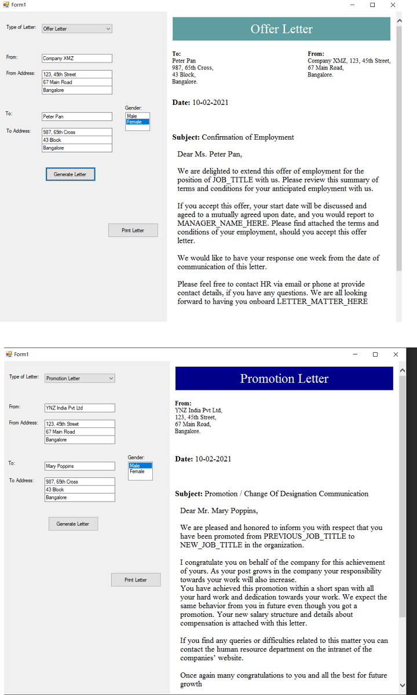

# Prototype Pattern (Creational Pattern)

## Overview
Prototype is a creational design pattern using which we can create a new instance of a class, by copying the existing fields of an object of the class.
The Prototype pattern creates new instance by delegating the cloning process to the actual objects that are being cloned. 

## Intent
New operator throughout the code is harmful
Use one instance of a class for use as a breeder of all future instances.
Specify the kinds of objects to create using a "typical" instance, and create new objects by copying this prototype.

## UML Diagram

## Code Example
The example shows a sinple application to generate official letters in an organization.

The sample initializes the different letter templates with default values. When a new letter needs to be generated, the template is cloned and the necessary fields are filled.

## Mapping the UML classes to Example code
| **File/Class Name** | **Mapping UML to Example Code**  |
| :-----: | :-: |
|[Base.Interfaces/ILetter.cs](./Base.Interfaces/Iletter.cs)|*Prototype interface*|
|[Imp.Letters/GenericLetter.cs](./Imp.Letters/GenericLetter.cs)|*Concrete Prototype*|
|[App.Main.Prototype/MainApp.cs](./App.Main.Prototype/MainApp.cs)|*Client*|

## Points to Remember
- The process of copying an object can be complicated.
- Classes that have circular references to other classes are difficult to clone.
- Overuse of the pattern could affect performance, as the prototype object itself would need to be instantiated if you use a registry of prototypes. 

## Resources
- https://dotnettutorials.net/lesson/prototype-design-pattern/
- https://exceptionnotfound.net/prototype-pattern-in-csharp/ 
- https://www.c-sharpcorner.com/article/prototype-design-pattern-easy-and-powerful-way-to-copy-obje/
- https://www.c-sharpcorner.com/UploadFile/SukeshMarla/learn-design-pattern-prototype-pattern/
