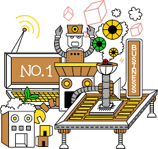

# Creational Patterns

## Overview
These are the patterns that deal with object creation mechanism

## Types of Creational Patterns
- [Abstract Factory](./AbstractFactory) : for creating a family of related objects
- [Builder](./Builder) : when there are a lot of steps involved in creation of an object or there are flavours of object possible 
- [Factory](./Factory) : provides interface to create objects
- [Object Pool](./ObjectPool) : provides a cache for instantiated objects reuse
- [Prototype](./Prototype) : new instance by cloning object being created
- [Singleton](./Singleton) : singke instance is created and maintained 

## Resources
- [https://sourcemaking.com/design_patterns/creational_patterns](https://sourcemaking.com/design_patterns/creational_patterns)
- [https://refactoring.guru/design-patterns/creational-patterns](https://refactoring.guru/design-patterns/creational-patterns)
