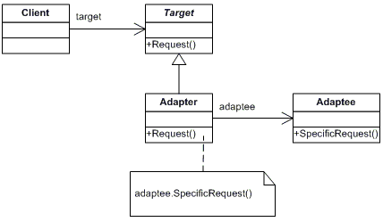
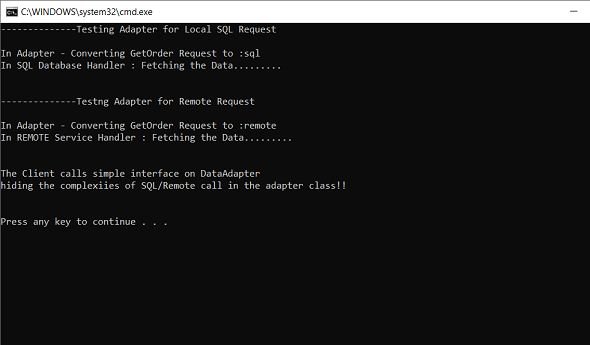

# Adapter Pattern

## Overview
The Adapter design pattern is a structural design pattern used when a client class has to use another class (adaptee) that it cannot recognize. 
This unfamiliar class is wrapped inside Adapter class by exposing interface to the client different than that of the adapter. 
This enabling the client to use the functionality of the adaptee without having a interface dependency on it.

## Intent
- Adapter converts the interface of a class into another interface clients expects enabling two entities to communicate which otherwise would not be able to do so due to incompatible interfaces.
- In situations where the client expetation and the existing implementation do not mach, convert the expectation of client into the existing implementation of a class
- In situations where the Implementaiton is overly complex and the client does not need to know the details of underlying implementation, create a wrapper Interface around the existing implementation to simplify the interface for the clients

## UML Class Diagram

## Code Example
The example shows how the adapter class hides the details of SQL database access from the client. 
The class adapts the client request to sql way and sql response to client understandable way. 
Note that the example could be extended with Factory method creational pattern to create SQL / Remote flavours of data provider.  
## Example Output 

## Mapping UML to example 
| **File/Class Name** | **Mapping Class in UML**  |
| :-----: | :-: |
|[Base.Interfaces/IDataAccess.cs](./Base.Interfaces/IDataAccess.cs)|*Target*|
|[Imp.DataAdapter/OrderDataAdapter.cs](./Imp.DataAdapter/OrderDataAdapter.cs)|*Adapter*|
|[Imp.RemoteDataProvider/RemoteDataService.cs](./Imp.RemoteDataProvider/RemoteDataService.cs)|*Adaptee*|
|[Imp.SqlDataProvider/SqlDataSource.cs](./Imp.SqlDataProvider/SqlDataSource.cs)|*Adaptee*|
|[App.Main.Adapter/Program.cs](./App.Main.Adapter/Program.cs)|*Client*|

## Points to Remember
- Adapter pattern is ususally used in a existing system / code to "bridge" the gap between the two worlds.
- The [Bridge pattern](https://github.com/madhurabindu/StructuralPatterns/tree/master/Bridge) on the other hand is during designing phase to keep the concerns separate from the beginning.
- Most often Adapter, Decorator, Proxy design patterns seem similar. The main difference among these patterns is
  - Adapter : Converts underlying implementation interface to clinet specific way
  - Decorator : Adds additional data, feature, functionality to underlying interface, hence build ontop of underlying interface
  - Proxy: Exposes exactly same interface as the underlying interface

## Reference 
- https://sourcemaking.com/design_patterns/adapter
- https://refactoring.guru/design-patterns/adapter
