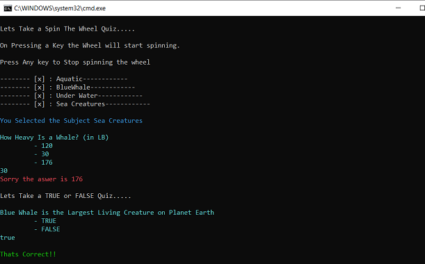

# Bridge Pattern

## Overview
The Bridge pattern is a Structural Design Pattern that allows us to separate the abstraction from the implementation so that both these entities can evolve independently.

## Intent
- Separate the Interface from the Implementation so that both can vary independently
- Publish the interface as a separate heirarchy and the implementation as its own heirarchy

## UML Class Diagram

## Code Example
In the Example code, we can see two entities Quiz and Questions. Quiz is published in a Separate interface IQuiz, but sinze IQuiz 'has a' Questions, instead of building implementation dependecy with Question class, the IQuiz 'has' IQuestion. Similarly IQuestion 'has' IAnswer. Hence all these abstractions and implementations can vary, evolve indepependent of one another.

As can be seen with the example a new Type of Quiz called SpinTheWheelQuiz is implemented using an existing type of IQuestion implementor class called MCQ.

For example Lets say, we need a new type of Quiz which is needs to be scored, this is not implemented in current system. However if we did not have a IQuestion interface separated from the IQuiz interface , then introducing Scoring mechanism in Question class would result in all clients of Question being affected.

With the Bridge design, a new class derived from IQuiz called ScoredQuiz can be created. A new Question type called ScoredQuestion derived from IQuestion can be created. The Scored Quiz can know about the Scored Question, and the other classes will not be affected.

Now assume there is a new Knowledge based Exam on a subject. We can create a new Quiz type called AptitudeTest derived from IQuiz but still reuse - ScoredQuestion since there is no new requirement of Aptitude exam on Question, but only on the Quiz format and pattern. Hence the IQuiz and IQuestion (and also IAnswer) can all evolve independently.

## Example Output 

## Mapping the UML classes to Example code
| **File/Class Name** | **UML to Example Code Mapping**  |
| :-----: | :-: |
|[Base.Interfaces/IQuiz.cs](./Base.Interfaces/IQuiz.cs)|*Abstraction*|
|[Base.Interfaces/IQuestion.cs](./Base.Interfaces/IQuestion.cs)|*ImplementorOne*|
|[Base.Interfaces/IAnswer.cs](./Base.Interfaces/IAnswer.cs)|*ImplementorTwo*|
|[Imp.Quizzes/SpinTheWheelQuiz.cs](./Imp.Quizzes/SpinTheWheelQuiz.cs)|*Refined AbstractionA*|
|[Imp.Quizzes/TrueOrFalseQuiz.cs](./Imp.Quizzes/TrueOrFalseQuiz.cs)|*Refined AbstractionB*|
|[Imp.Questionaires/MCQ.cs](./Imp.Questionaires/MCQ.cs)|*Concrete ImplementorOne1*|
|[Imp.Questionaires/TrueOrFalse.cs](./Imp.Questionaires/TrueOrFalse.cs)|*Concrete ImplementorOne2*|

## Points to Remember
- Use Bridge pattern when we see implementation classes creeping into your interfaces
- Also when we need runtime binding between classes
- When our interface has two orthoginal entities in the system coming together, it is a good candidate to desing it as a Bridge pattern.

## Reference 
- https://refactoring.guru/design-patterns/bridge
- https://sourcemaking.com/design_patterns/bridge

