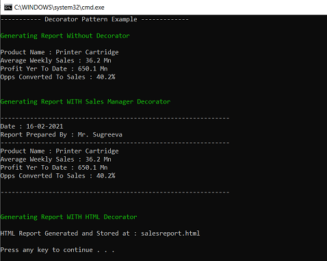

# Decorator Pattern (Structural Pattern)

## Overview
Decorator pattern allows a user to add new functionality to an existing object without altering its structure.

## Intent
- Decorate the original object with additional functionality responsibilities. 
- The pattern provide an alternative to subclassing for extending functionality.
- Client-specified requirements can be added to existing functionality in core object by recursively wrapping it.

## UML Diagram

## Code Example
The Example shows an IReport interface which is implemented in SalesReport Class. There are two decorators for the same. 
- A Decorator to be reviewed and authorized by a manager
- A Decorator to Formatted in HTML format
The decorators can be accessed for IReport interface and enhanced with respective functionality.

## Example Output

## Mapping the UML classes to Example code
| **File/Class Name** | **Mapping Class in UML**  |
| :-----: | :-: |
|[Base.Interface/IReport.cs](./Base.Interface/IReport.cs)|*Component*|
|[Imp.Report/SalesReport.cs](./Imp.Report/SalesReport.cs)|*ConcreteComponent*|
|[Imp.Report/ReportDecorator.cs](./Imp.Report/ReportDecorator.cs)|*Decorator*|
|[Imp.Report/SalesManagerReportDecorator.cs](./Imp.Report/SalesManagerReportDecorator.cs)|*ConcreteDecorator*|
|[Imp.Report/HTMLReportDecorator.cs](./Imp.Report/HTMLReportDecorator.cs)|*ConcreteDecorator*|

## Points to Remember
Difference Between Proxy and Decorator
 - Decorator provides an enhanced interface where as Proxy provides the same interface.
- Decorator and Proxy have different purposes but similar structures. Both describe how to provide a level of indirection to another object, and the implementations keep a reference to the object to which they forward requests.
- Decorator can be viewed as a degenerate Composite with only one component. However, a Decorator adds additional responsibilities - it isn't intended for object aggregation.
- Decorator supports recursive composition
- The Decorator class declares a composition relationship to the LCD (Lowest Class Denominator) interface, and this data member is initialized in its constructor.

## Resources
- https://sourcemaking.com/design_patterns/decorator
- https://refactoring.guru/design-patterns/decorator

