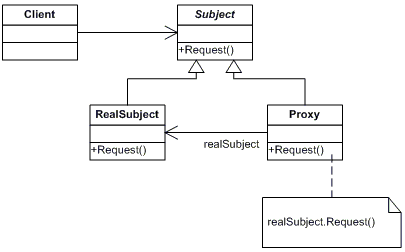
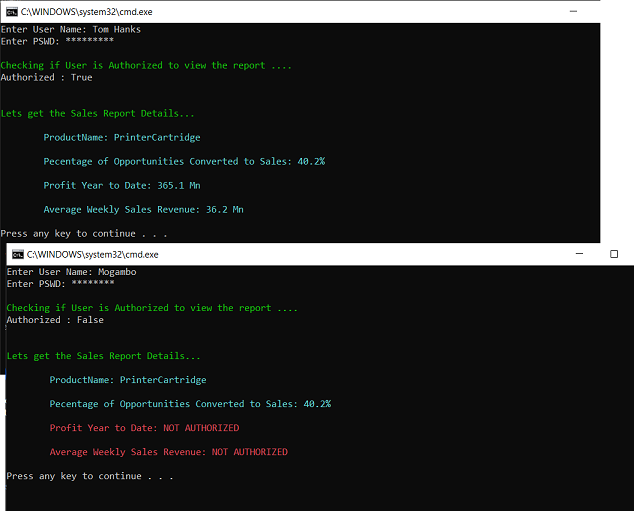

# Proxy Pattern (Structural Pattern)

## Overview
According to GoF definition of proxy design pattern, a proxy object provide a surrogate or placeholder for another object to control access to it. A proxy is basically a substitute for an intended object which we create due to many reasons e.g. security reasons or cost associated with creating fully initialized original object.

## Intent
A proxy object hides the original object and control access to it. We can use proxy when we may want to use a class that can perform as an interface to something else.

## UML Diagram

## Code Example

## other examples

Consider an image viewer program that lists and displays high resolution photos. The program has to show a list of all photos however it does not need to display the actual photo until the user selects an image item from a list.

Proxy Pattern Virtual Proxy Example - UML Class Diagram

## Example Output

## Mapping the UML classes to Example code
| **File/Class Name** | **Mapping Class in UML**  |
| :-----: | :-: |

## Points to Remember
From [This Blog Post](https://howtodoinjava.com/design-patterns/structural/proxy-design-pattern/)
Proxies are generally divided into four types –
- Remote proxy : represent a remotely lactated object. To talk with remote objects, the client need to do additional work on communication over network. A proxy object does this communication on behalf of original object and client focuses on real talk to do.
- Virtual proxy : delay the creation and initialization of expensive objects until needed, where the objects are created on demand. Hibernate created proxy entities are example of virtual proxies.
- Protection proxy : help to implement security over original object. They may check for access rights before method invocations and allow or deny access based on the conclusion.
- Smart Proxy : performs additional housekeeping work when an object is accessed by a client. An example can be to check if the real object is locked before it is accessed to ensure that no other object can change it.

- Virtual Proxies: delaying the creation and initialization of expensive objects until needed, where the objects are created on demand (For example creating the RealSubject object only when the doSomething method is invoked).
- Remote Proxies: providing a local representation for an object that is in a different address space. A common example is Java RMI stub objects. The stub object acts as a proxy where invoking methods on the stub would cause the stub to communicate and invoke methods on a remote object (called skeleton) found on a different machine.
- Protection Proxies: where a proxy controls access to RealSubject methods, by giving access to some objects while denying access to others.
- Smart References: providing a sophisticated access to certain objects such as tracking the number of references to an object and denying access if a certain number is reached, as well as loading an object from database into memory on demand.

Difference Between Proxy and Decorator
 - Proxy provides the same interface. Decorator provides an enhanced interface.
- Decorator and Proxy have different purposes but similar structures. Both describe how to provide a level of indirection to another object, and the implementations keep a reference to the object to which they forward requests.

## Resources
- https://howtodoinjava.com/design-patterns/structural/proxy-design-pattern/
